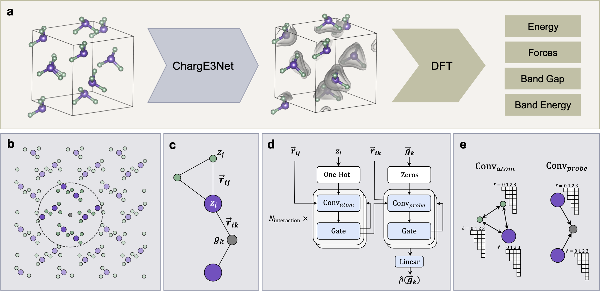

# ChargE3Net



Official implementation of ChargeE3Net, introduced in [Higher-Order Equivariant Neural Networks for Charge Density Prediction in Materials](https://www.nature.com/articles/s41524-024-01343-1).

## Citation

```bibtex
@article{koker2024higher,
  title={Higher-order equivariant neural networks for charge density prediction in materials},
  author={Koker, Teddy and Quigley, Keegan and Taw, Eric and Tibbetts, Kevin and Li, Lin},
  journal={npj Computational Materials},
  volume={10},
  number={1},
  pages={161},
  year={2024},
  publisher={Nature Publishing Group UK London}
}
```

------------

## Usage

Install dependencies in environment:

```bash
pip install -r requirements.txt
```

### Note on SLURM Usage

The `src/train_from_config.py` and `src/test_from_config.py` scripts can be run
on multiple nodes and GPUs with the `--multinode` or `-m` flag. Our configs
assume a configuration of 2 nodes, each with 2 GPUs. **You will likely need to
adjust the [Slurm Launcher Parameters](https://hydra.cc/docs/plugins/submitit_launcher/)
in the `hydra.launcher` section of the config to work with your system**.
Alternatively you can run the commands on a single gpu system without the `-m`
flag:

```bash
python src/<train,test>_from_config -cd configs/charge3net -cn <config name> nnodes=1 nprocs=<number of GPUs to use>
```

However, training models with a different number of nodes/GPUs may result in
different performance due to change in effective batch size.

### Inference on additional CHGCAR files

Given a directory containing CHGCAR files (do not need to be at top level in directory), a set of ChargE3Net input files can be created with the following script:

```bash
python scripts/convert_chgcar_dir_to_pkl_dir.py --input <directory containing CHGCARs> --output <new directory> [--workers WORKERS]
```

>NOTE: If there are more than 10 CHGCARs in the input directory, it is recommended to add additional workers. 5 workers is a good choice to start with.


This will add all necessary input files to the new directory specified by `--output`, with the following tree

```bash
/path/to/charge3net_inputs/
├── filelist.txt
├── chgcar1.npy
├── chgcar1_atoms.pkl
├── chgcar2.npy
├── chgcar2_atoms.pkl
├── path_to_chgcar3.npy
├── path_to_chgcar3_atoms.pkl
├── probe_counts.csv
└── split.json
```

Now, the ChargE3Net model can be used to compute charge density, with this directory as input:

```bash
python src/test_from_config.py -cd configs/charge3net/ -cn test_chgcar_inputs.yaml input_dir=</path/to/charge3net_inputs/> -m
```

The model predictions will show up in the `/path/to/charge3net_inputs/` directory


### Test Pretrained Models

Download datasets. See [Datasets](#datasets) for instructions for each dataset.

Materials Project:

```bash
python src/test_from_config.py -cd configs/charge3net -cn train_mp_e3_final.yaml checkpoint_path=models/charge3net_mp.pt -m
```

QM9:

```bash
python src/test_from_config.py -cd configs/charge3net -cn train_qm9_e3_final.yaml checkpoint_path=models/charge3net_qm9.pt -m
```

NMC:

```bash
python src/test_from_config.py -cd configs/charge3net -cn train_nmc_e3_final.yaml checkpoint_path=models/charge3net_nmc.pt -m
```

### Train Models From Scratch

Download datasets. See [Datasets](#datasets) for instructions for each dataset.

Materials Project:

```bash
python src/train_from_config.py -cd configs/charge3net -cn train_mp_e3_final.yaml  -m
```

QM9:

```bash
python src/train_from_config.py -cd configs/charge3net -cn train_qm9_e3_final.yaml -m
```

NMC:

```bash
python src/train_from_config.py -cd configs/charge3net -cn train_nmc_e3_final.yaml  -m
```


## Datasets


### Materials Project

1. Use our python script to download the  MP Charge Density Data (using the [Materials Project API](https://github.com/materialsproject/api)):

```bash
python download/download_materials_project.py \
	--out_path ./data/mp_raw \
	--workers WORKERS \
	--task_id_file ./data/mpid_to_task_id_map.json \
	--mpi_api_key <"Your MP API Key">
```

Optionally, you can exclude the `task_id_file` to download the latest data from materials project, including any updates to the dataset since we obtained a copy. For reproducible results, use the above call.

```bash
python download/download_materials_project.py \
	--out_path ./data/mp_raw \
	--workers WORKERS \
	--mpi_api_key <"Your MP API Key">
```

2. Convert the CHGCAR files to numpy and pickle files for faster reading with [scripts/batch_pickle_mp_charge_density.py](./scripts/batch_pickle_mp_charge_density.py)
```bash
python scripts/batch_pickle_mp_charge_density.py --raw_data_dir ./data/mp_raw --pkl_data_dir ./data/mp/
```

#### Additional Steps (optional)
These files are provided, but you can optionally reproduce them with the following scripts:

>**NOTE: The files produced by the scripts below may not yield exactly reproducible results, given changes to the materials project dataset. It is recommended to use the files provided in the [data/](./data/) directory.**

3. Create a list of mpids with `ls ./data/mp_raw -1 >  ./data/mp/filelist.txt`
4. Add a probe counts file with [scripts/write_mp_probe_count_file.py](./scripts/write_mp_probe_count_file.py)
```bash
python scripts/write_mp_probe_count_file.py --filelist ./data/mp_raw/filelist.txt --workers WORKERS
```
5. Create the datasplits with [scripts/write_mp_datasplits.py](./scripts/write_mp_datasplits.py)

### QM9

Download from [Jørgensen and Bhowmik](https://data.dtu.dk/articles/dataset/QM9_Charge_Densities_and_Energies_Calculated_with_VASP/16794500)
into `data/qm9`.

### NMC

Download from [Jørgensen and Bhowmik](https://data.dtu.dk/articles/dataset/NMC_Li-ion_Battery_Cathode_Energies_and_Charge_Densities/16837721)
into `data/nmc`.

### GNoME

Structures obtained from [google-deepmind/materials_discovery](https://github.com/google-deepmind/materials_discovery). See `data/gnome/filelist.txt` for the list of file IDs studied in our work.

## Extra Notes on Testing

#### Method 1 (Preferred)
A checkpoint can be tested with the following syntax:

```bash
python src/test_from_config.py -cd configs/charge3net/ -cn train_mp.yaml checkpoint_path=<checkpoint_path> <-m> <relevant overrides>
```

> NOTE: The outputs saved from this method will not show up in the same directory tree as your `checkpoint_path`. They will appear in the `hydra.job.name` directory from configs/charge3net/train_mp.yaml. To fix this, you can override a location to save outputs within the `checkpoint_path` tree, like so: `trainer.logger.save_dir=<some output dir>`

In this case `<relevant overrides>` is considered to be anything that changes the model parameters, or other parameters related to testing the model. The model overrides need to match the config elements that were used to create the checkpoint at `checkpoint_path`. Relevant parameters might include:

- `model.model.num_interactions`: typically 3 for PaiNN and 6 for Schnet
- `data.test_probes`: 1000 for a quick test, `null` for all probes (full grid)
- `cube_dir`: directory to output density cube predictions (output as .npy arrays)

#### Method 2
An alternative way to test the model is to pass the output config from a training run directly. 

```bash
python src/test_from_config.py -cd results/charge3net/mp/2023-05-01/12-49-14/0/.hydra/ -cn config trainer.num_nodes=1 trainer.devices=1 data.test_probes=1000 trainer.logger.save_dir=results/charge3net/mp/2023-05-01/12-49-14/0/test_0 -m
```

However, if running in a distributed testing fashion using slurm this method will NOT work. Paths and launcher info are located in the output hydra.yaml file, and inaccessible from the output config.yaml. 

#### Method 3
To bypass these issues, you need to specify relevant paths and info as overrides, as so:

```bash
python src/test_from_config.py -cd results/charge3net/mp/2023-05-01/12-49-14/0/.hydra/ -cn config.yaml hydra/launcher=submitit_slurm hydra.job.name=mp hydra.run.dir=results/charge3net/mp/2023-05-01/12-49-14/0/ hydra.sweep.dir='${hydra.run.dir}' hydra.launcher.partition=gaia hydra.sweep.subdir=test hydra.launcher.nodes='${trainer.num_nodes}' hydra.launcher.tasks_per_node='${trainer.devices}' hydra.launcher.constraint=xeon-g6 +hydra.launcher.additional_parameters.gres=gpu:volta:2 trainer.num_nodes=1 trainer.devices=2 data.test_probes=1000 -m
```

This method can be cumbersome, but if its difficult to reference the original config and you need to run distributed testing/inference, this will work.


## Disclaimer


DISTRIBUTION STATEMENT A. Approved for public release. Distribution is unlimited.

This material is based upon work supported by the Under Secretary of Defense for Research and Engineering under Air Force Contract No. FA8702-15-D-0001. Any opinions, findings, conclusions or recommendations expressed in this material are those of the author(s) and do not necessarily reflect the views of the Under Secretary of Defense for Research and Engineering.

© 2023 Massachusetts Institute of Technology.

Subject to FAR52.227-11 Patent Rights - Ownership by the contractor (May 2014)

The software/firmware is provided to you on an As-Is basis

Delivered to the U.S. Government with Unlimited Rights, as defined in DFARS Part 252.227-7013 or 7014 (Feb 2014). Notwithstanding any copyright notice, U.S. Government rights in this work are defined by DFARS 252.227-7013 or DFARS 252.227-7014 as detailed above. Use of this work other than as specifically authorized by the U.S. Government may violate any copyrights that exist in this work.
